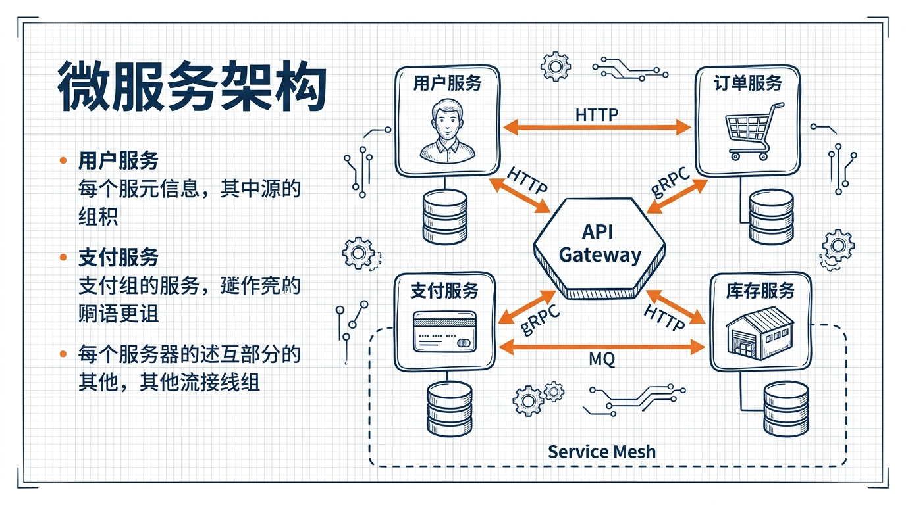
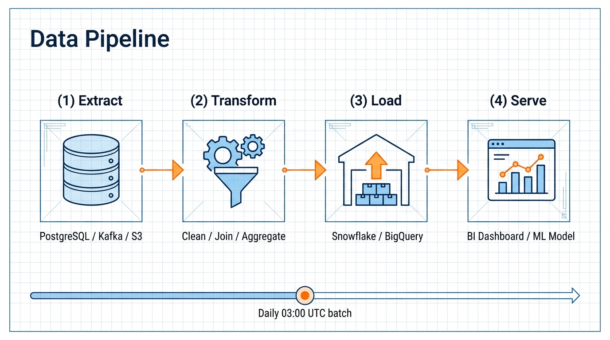
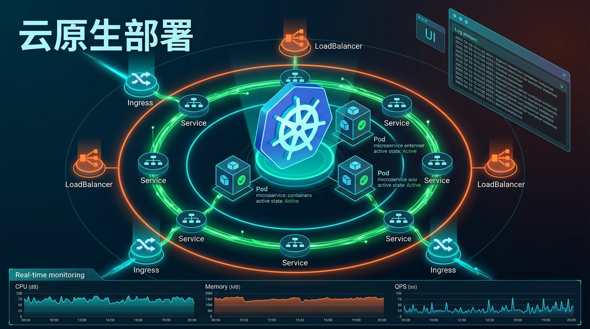
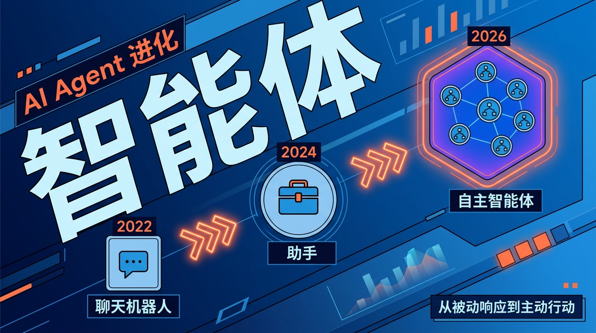

# tech-illustration

[English](README.md) · [中文](README_zh.md)

> A multi-style technical illustration generator. Ships as an [Agent Skill](https://docs.claude.com/en/docs/claude-code/skills) (works with Claude Code, Cursor, or any agent that reads `SKILL.md`) and also as a standalone Python CLI.

Give it a concept, pick a style, get a publication-ready image. Currently powered by Google's Gemini 3.1 Flash Image — chosen because it produces the best results for technical diagrams today.

## Styles

| Style | Preview |
|-------|---------|
| **blueprint** — engineering grid, navy + orange, hand-drawn feel. Default. |  |
| **clean** — minimalist vector diagram, white background. |  |
| **dynamic** — isometric, glowing energy flows, dark background. |  |
| **bold** — avant-garde editorial, massive typography. |  |

## Install

### In any agent — just ask

Most agents that support skills can install from a URL. For example in Claude Code:

```
Please install the tech-illustration skill from
https://github.com/Nayuta403/tech-illustration
```

The agent will clone it into its skills directory (e.g. `~/.claude/skills/tech-illustration` for Claude Code) and pick it up via `SKILL.md`. Then use it whenever you want:

> Generate a blueprint-style illustration of our OAuth flow.

### Manual (or standalone CLI)

If you'd rather do it yourself, or use the script without any agent:

```bash
git clone https://github.com/Nayuta403/tech-illustration.git
cd tech-illustration
export GEMINI_API_KEY="your-key-here"

uv run scripts/gen_illustration.py \
  --topic "Your detailed topic" \
  --filename out.png \
  --style blueprint \
  --lang zh
```

## Requirements

- Python 3.10+
- [`uv`](https://docs.astral.sh/uv/) (recommended — inline script deps, no `pip install` needed)
- A Google Gemini API key: <https://aistudio.google.com/app/apikey>

The Python dependencies (`google-genai`, `pillow`) are declared inline in the script, so `uv run` handles the environment automatically.

## Usage

### Via an agent (recommended)

Just describe what you want in natural language — the agent will call the script for you. A few examples:

```
Draw a blueprint-style illustration of our OAuth 2.0 authorization-code
flow and save it as oauth.png.
```

```
Generate a dynamic tech illustration of a Kubernetes deployment with
Ingress, Services, and Pods. Output: k8s.png. Use Chinese labels.
```

```
Make a bold editorial cover image for my article about AI agents —
three evolution stages (ChatBot 2022, Assistant 2024, Autonomous Agent
2026), diagonal layout, English labels. Save as cover.png.
```

If the output looks sparse or generic, your description was probably too short — read **Writing good topics** below, then ask the agent to retry with a richer prompt.

### Direct CLI

```
uv run scripts/gen_illustration.py \
  --topic  TEXT   # what to draw (see "Writing good topics" below)
  --filename PATH # output .png path
  [--style  blueprint | clean | dynamic | bold]   # default: blueprint
  [--lang   zh | en]                              # default: zh
  [--api-key KEY]                                 # overrides GEMINI_API_KEY
```

### Writing good topics

Output quality is bounded by the information density of your topic. A short prompt like *"Microservices architecture"* will give you a generic, empty-feeling image.

Instead, describe:

1. What each element draws (icons, shapes, labels)
2. All the on-image text explicitly
3. Color meanings (e.g. "red = current state")
4. The overall message in one sentence

See `SKILL.md` for a detailed before/after example.

## Model

Currently pinned to `gemini-3.1-flash-image-preview`. In our testing this model gives the best results for technical diagrams — clean typography, accurate layout, correct icons — so we standardise on it rather than shipping a multi-provider abstraction.

The model name is a single constant in `scripts/gen_illustration.py`. If you want to try a different image model (Imagen, another provider, or a newer Gemini), swap the model string and adapt the SDK call — but cross-model compatibility isn't maintained here, you'll own that fork.

Since the current model is a preview SKU, Google may rename or deprecate it — update the model string when that happens.

## Security

The script only reads `GEMINI_API_KEY` from the environment (or `--api-key`). No key is ever written to disk or logged. If you fork this, double-check before committing.

## License

MIT — see [LICENSE](LICENSE).
